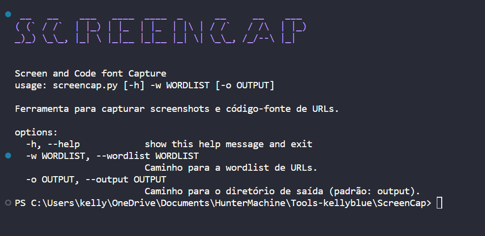

# ScreenCap
---
A ferramenta ScreenCap é uma aplicação em Python projetada para capturar screenshots e código-fonte de URLs de forma rápida e eficiente. Ela utiliza Selenium e threading para acelerar o processo, e pode ser personalizada através da passagem de uma wordlist contendo as URLs alvo.



## Funcionalidades
- Captura de screenshots de URLs.
- Salva o código-fonte das páginas visitadas.
- Utiliza threading para aumentar a eficiência.
- Personalizável através de uma wordlist.

## Uso
1. Clone o repositório: `git clone https://github.com/seu-username/ScreenCap.git`
2. Navegue até o diretório: `cd ScreenCap`
3. Instale as dependências: `pip install -r requirements.txt`
4. Execute a ferramenta: `python screencap.py -w wordlist.txt`

## Opções
- `-w, --wordlist`: Caminho para a wordlist de URLs.
- `-o, --output`: Caminho para o diretório de saída (padrão: output).

## Exemplo

```bash
python screencap.py -w urls.txt -o output_folder
```

## Contribuições

Contribuições são bem-vindas! Sinta-se à vontade para abrir issues ou pull requests.

## Licença

Este projeto é licenciado sob a Licença MIT - veja o arquivo LICENSE para detalhes.