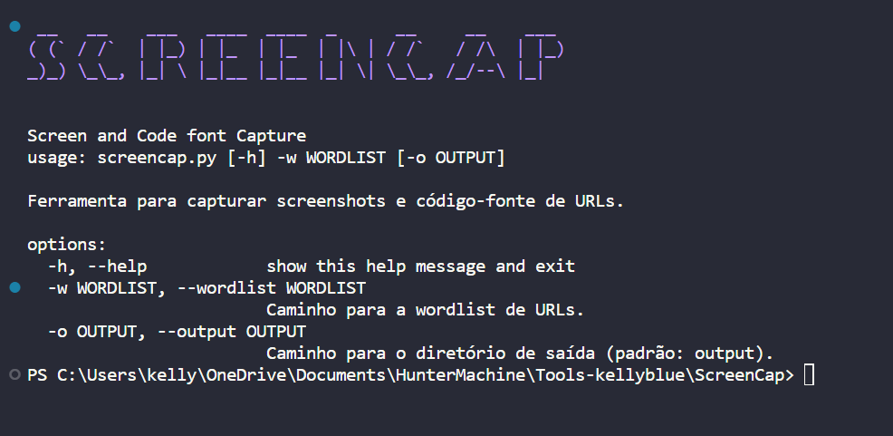

# ScreenCap
---
ScreenCap is a Python application designed to capture screenshots and page source code from URLs quickly and efficiently. It utilizes Selenium and threading to speed up the process and can be customized by passing a wordlist containing the target URLs.



## Features
- Captures screenshots of URLs.
- Saves the page source of visited pages.
- Uses threading to increase efficiency.
- Customizable through a wordlist.

## Usage
1. Clone the repository: `git clone https://github.com/kelly-blue/ScreenCap.git`
2. Navigate to the directory: `cd ScreenCap`
3. Install dependencies: `pip3 install -r requirements.txt` or `pip install -r requirements.txt`
4. Run the tool: `python3 screencap.py -w wordlist.txt`

## Options
- `-w, --wordlist`: Path to the URL wordlist.
- `-o, --output`: Path to the output directory (default: output).

## Example
```bash
python3 screencap.py -w urls.txt -o output_folder
```
## Contributions
Contributions are welcome! Feel free to open issues or pull requests.

## License
This project is licensed under the MIT License - see the LICENSE file for details.